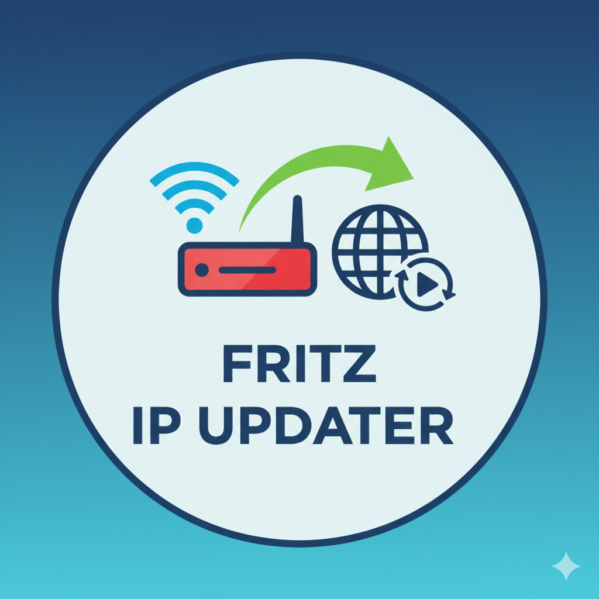

# Fritz IP Updater [](https://hub.docker.com/repository/docker/entringer/fritz-ip-updater) [](https://hub.docker.com/repository/docker/entringer/fritz-ip-updater)

<p align="center">
  
</p>

A Python application that monitors your Fritz!Box router's external IP address and automatically updates your dynamic DNS domain when the IP changes.

## Objective

This application solves the problem of keeping your dynamic DNS service up-to-date when your ISP changes your external IP address. It:

- Connects to your Fritz!Box router to retrieve the current external IP address
- Compares it with the previously known IP address
- Updates your dynamic DNS domain if the IP has changed (currently supports DuckDNS)
- Logs all activities for monitoring and debugging

## How It Works

1. **IP Detection**: The application uses the `fritzconnection` library to connect to your Fritz!Box router and retrieve the current external IP address along with other status information.

2. **Change Detection**: It compares the current external IP with the last known IP stored in `data/last_ip.txt`.

3. **DNS Update**: If the IP has changed, it makes an API call to your dynamic DNS provider to update your domain with the new IP address.

4. **State Persistence**: The new IP is saved to file for future comparisons.

5. **Logging**: All operations are logged both to console and to `data/fritz_ip_updater.log` for monitoring.

## Required Parameters

The application requires the following configuration parameters, which should be set in a `.env` file:

### Fritz!Box Configuration
- `FRITZBOX_HOST` - The hostname or IP address of your Fritz!Box (default: "fritz.box")
- `FRITZBOX_USER` - Username for Fritz!Box authentication
- `FRITZBOX_PASSWORD` - Password for Fritz!Box authentication

### Dynamic DNS Configuration (Currently DuckDNS)
- `DUCKDNS_TOKEN` - Your DuckDNS authentication token
- `DUCKDNS_DOMAIN` - Your DuckDNS subdomain (without .duckdns.org)

### Application Configuration
- `UPDATE_INTERVAL_MINUTES` - Interval in minutes between IP checks (default: 5)

*Note: Future versions will support additional dynamic DNS providers.*

## Setup

1. **Clone or download** this repository

2. **Create a virtual environment** (recommended):
   ```bash
   make venv
   source .venv/bin/activate
   make install
   ```
   Or manually:
   ```bash
   python3 -m venv .venv
   source .venv/bin/activate
   pip install -r requirements.txt
   ```

3. **Configure your environment**:
   - Copy `.env.example` to `.env`
   - Fill in your Fritz!Box and dynamic DNS provider credentials:
   ```bash
   cp .env.example .env
   # Edit .env with your actual values
   ```

4. **Run the application**:
   ```bash
   make run
   ```
   Or directly:
   ```bash
   python main.py
   ```

## Docker

The application can be easily deployed using Docker for a containerized environment. This provides better isolation, resource control, and simplified deployment across different systems.

### Quick Start
```bash
# Copy and configure environment variables
cp .env.example .env
# Edit .env with your credentials

# Build and run with Make commands (recommended)
make docker-up

# View logs
make docker-logs
```

### Features
- **Lightweight**: Alpine Linux-based image (~50MB)
- **Security**: Runs as non-root user with resource limits
- **Persistent data**: Mounts `./data` directory for logs and IP tracking
- **Health monitoring**: Built-in container health checks

For detailed Docker setup instructions, configuration options, and troubleshooting, see [docker/DOCKER.md](docker/DOCKER.md).

## Dependencies

- `fritzconnection>=1.15.0` - For connecting to Fritz!Box routers
- `python-dotenv>=1.1.1` - For loading environment variables from .env file
- `requests` - For making HTTP requests to dynamic DNS APIs (included in fritzconnection dependencies)

## Logs

The application maintains detailed logs in two locations:

### Console Output
Real-time logging is displayed in the console when running the application.

### Log File: `data/fritz_ip_updater.log`
Persistent logging with timestamps including:
- Application startup messages
- IP change detections with old and new IPs
- Dynamic DNS update success/failure messages
- Error messages and exceptions
- No-change confirmations

### Log Format
```
2025-09-10 10:30:15,123 - INFO - Starting Fritz IP Updater...
2025-09-10 10:30:16,456 - INFO - IP change detected: 100.84.189.106 -> 100.84.189.107
2025-09-10 10:30:17,789 - INFO - Dynamic DNS updated successfully.
```

## Makefile Commands

- `make run` - Run the application
- `make install` - Install dependencies only
- `make venv` - Create virtual environment only
- `make clean` - Remove virtual environment and cache files
- `make help` - Show available commands

## Usage Scenarios

### Manual Execution
Run once to check and update if needed:
```bash
make run
```

### Scheduled Execution
Add to your crontab for automatic updates (example: every 5 minutes):
```bash
*/5 * * * * cd /path/to/fritz-ip-updater && make run
```

### Systemd Service
Create a systemd timer for regular execution on Linux systems.

## Troubleshooting

1. **Fritz!Box Connection Issues**:
   - Verify your Fritz!Box credentials in `.env`
   - Ensure the Fritz!Box is accessible on your network
   - Check if the Fritz!Box user has sufficient permissions

2. **Dynamic DNS Update Failures**:
   - Verify your dynamic DNS provider credentials in `.env`
   - Check network connectivity to your DNS provider
   - Review the logs for specific error messages

3. **Permission Issues**:
   - Ensure the `data/` directory is writable
   - Check file permissions for `last_ip.txt` and log files

## Security Notes

- Keep your `.env` file secure and never commit it to version control
- The `.env` file contains sensitive credentials for both Fritz!Box and your dynamic DNS provider
- Consider using environment variables instead of the `.env` file in production environments